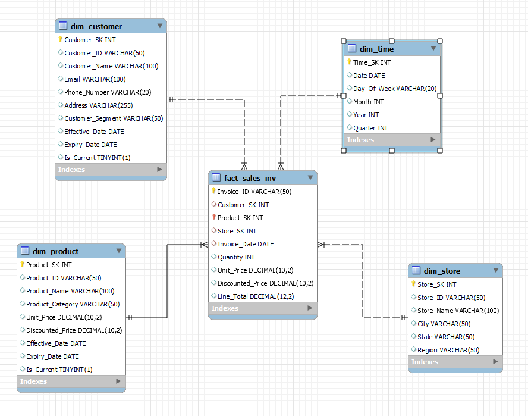
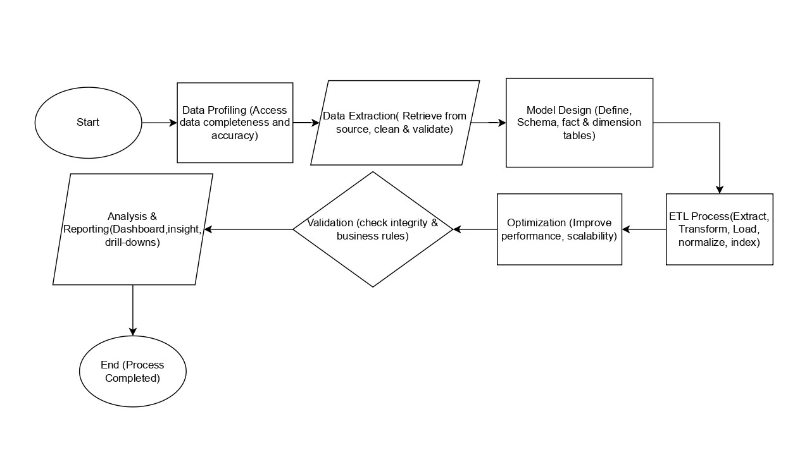

# Data-Modelling

# Invoice-Based Dimensional Modelling 

## Overview

In many real-world scenarios, business requirements may be inferred directly from the available data. In this assignment, you will work with a sample invoice dataset and reverse-engineer the essential business dimensions. Your task is to design an end-to-end dimensional model that captures the critical information required for business analysis and reporting.

Your solution should support key analytical capabilities such as drill-down reporting and historical analysis, while ensuring data quality and scalability. You will need to infer dimensions such as Customer, Product, Time, and Store from the invoice data provided.

---

## Business Scenario

Imagine you are working for a mid-sized retail company that issues invoices for every sale. Although explicit business requirements have not been documented, you have access to the following invoice data. Your goal is to design a dimensional model that can power a robust analytics platform, enabling insights into customer behavior, product performance, and store-level sales.

### Business Objectives (Inferred from Data)

- **Analytical Reporting:** Provide detailed analysis on sales trends, customer purchasing patterns, and product performance.
- **Drill-Down Capability:** Allow multi-level analysis (e.g., overall sales → sales by store, by product category, by customer segments).
- **Historical Tracking:** Maintain a record of past transactions to support trend analysis and forecast planning.
- **Scalability & Performance:** Ensure the model can scale with data growth and support efficient querying.

## Sample Invoice Data
## 🧾 Sales Invoice Table

| Invoice_ID | Invoice_Date         | Customer_ID | Customer_Name | Product_ID | Product_Name        | Quantity | Unit_Price | Line_Total | Store_ID |
|------------|----------------------|-------------|----------------|------------|----------------------|----------|------------|------------|----------|
| INV001     | 2025-03-15 09:15:00  | C001        | John Smith     | P1001      | Wireless Mouse       | 2        | 25.00      | 50.00      | S01      |
| INV001     | 2025-03-15 09:15:00  | C001        | John Smith     | P1002      | Mechanical Keyboard  | 1        | 85.00      | 85.00      | S01      |
| INV002     | 2025-03-15 10:05:00  | C002        | Jane Doe       | P1003      | HD Monitor           | 1        | 200.00     | 200.00     | S02      |
| INV003     | 2025-03-15 11:30:00  | C003        | Bob Johnson    | P1001      | Wireless Mouse       | 1        | 25.00      | 25.00      | S01      |
| INV003     | 2025-03-15 11:30:00  | C003        | Bob Johnson    | P1004      | USB-C Hub            | 2        | 30.00      | 60.00      | S01      |

## Requirements

### 1. Data Profiling & Inference

- **Identify Dimensions:** Analyze the invoice dataset and determine which attributes should be modelled as dimensions.
- **Determine Fact Table Granularity:** Establish the grain of your fact table based on the invoice line items. Justify your decisions in terms of the types of analysis the business might require.

### 2. Dimensional Modeling Strategy

- **Star Schema Design:** Develop a star schema that integrates your fact table with conformed dimensions.
- **Handling Degenerate Dimensions:** Identify any degenerate dimensions and describe how they will be managed within your model.

### 3. Slowly Changing Dimensions (SCD)

- **SCD Implementation:** Describe how you would handle slowly changing dimensions for attributes that may change over time. Discuss the approach for implementing SCD types (Type 1, Type 2, or Type 3) and the trade-offs involved.

### 4. ETL/ELT Strategy

- **Data Integration:** Outline your strategy for ingesting the invoice data into your dimensional model. Consider both batch processing and the possibility of integrating incremental data updates.
- **Data Quality & Consistency:** Explain how you will ensure data quality, consistency, and timely updates across your fact and dimension tables.

### 5. Advanced Analysis & Scalability

- **Hierarchical Relationships:** Discuss how you might design and incorporate multi-level hierarchies to support detailed drill-down analysis.
- **Performance Optimization:** Recommend strategies such as partitioning, indexing, and surrogate key generation to optimize query performance as data volume grows.

## 📊 Data Profiling & Inference

### 🔎 Identified Dimensions and Fact Table Attributes

---

### 1. 🧍 Customer Dimension (`Dim_Customer`)
- **Attributes**: 
  - Customer ID
  - Name
  - Email
  - Segment (VIP, Regular)
  - Address
  - Effective & Expiry Dates *(SCD Type 2)*
- **Relationship**:  
  `Fact_Sales_Inv.Customer_SK` → `Dim_Customer.Customer_SK`

---

### 2. 📦 Product Dimension (`Dim_Product`)
- **Attributes**:
  - Product ID
  - Name
  - Category
  - Unit Price
  - Discounted Price
  - Effective & Expiry Dates
- **Relationship**:  
  `Fact_Sales_Inv.Product_SK` → `Dim_Product.Product_SK`

---

### 3. 🏬 Store Dimension (`Dim_Store`)
- **Attributes**:
  - Store ID
  - Name
  - City
  - State
  - Region
- **Relationship**:  
  `Fact_Sales_Inv.Store_SK` → `Dim_Store.Store_SK`

---

### 4. 🗓️ Time Dimension (`Dim_Time`)
- **Attributes**:
  - Date
  - Day of Week
  - Month
  - Year
  - Quarter
- **Relationship**:  
  `Fact_Sales_Inv.Invoice_Date` → `Dim_Time.Date`

---

### 5. 📈 Fact Table (`Fact_Sales_Inv`)
- **Attributes**:
  - Invoice ID
  - Customer_SK
  - Product_SK
  - Store_SK
  - Invoice_Date
  - Quantity
  - Unit Price
  - Discounted Price
  - Line Total
**Granularity**: One row per invoice line item.
**Relationships**: Links to Customer, Product, Store, and Time dimensions.

## 🧮 Determining Fact Table Granularity

---

### 📌 Granularity Definition

Each row in the `Fact_Sales` table represents a **single line item of an invoice**, identified by the combination of:
- `Invoice_ID`
- `Product_SK`

---

###  Justification for This Granularity

#### 1. Detailed Transactional Reporting
- Captures **individual products purchased** within each invoice.
- Allows tracking of:
  - Discounts
  - Unit Prices
  - Quantities  
  ...at the **most atomic level**.

#### 2.  Supports Aggregated Reports
- Can be **aggregated** to show total sales:
  - Per Customer
  - Per Store
  - Over Time
- Enables reporting at:
  - Daily
  - Monthly
  - Quarterly
  - Yearly levels

#### 3.  Enables Drill-Down Analysis
Allows users to explore data from **high-level summaries** to detailed views:
- **Total Sales** → By Invoice
- **Invoice Details** → By Product
- **Product Details** → By Store

>  *Facilitates trend detection, top-selling products, and understanding customer behavior.*

#### 4. Tracks Price Variations at the Invoice Line Level
- Captures both **Unit Price** and **Discounted Price** at time of sale.
- Supports:
  - **Profitability analysis** (e.g., effect of discounts on revenue)
  - **Price optimization strategies**

---



---

## 🧾 Handling Degenerate Dimensions (DDs)

---

### 📖 What is a Degenerate Dimension?

A **Degenerate Dimension (DD)** is an attribute that:

- Exists **within the fact table**.
- Does **not have a separate dimension table**.
- Typically includes **transactional identifiers** such as `Invoice_ID`.

>  These attributes:
> - Do **not contain descriptive details**.
> - Are used for **grouping, filtering, or analytical tracking**.

---

###  Identified Degenerate Dimension in Our Model

**`Invoice_ID`** is a **degenerate dimension** because:

- It **does not have additional descriptive attributes** to warrant a separate dimension table.
- It is stored directly in the `Fact_Sales` table.
- It serves as a **unique identifier for each transaction**.

---

###  How Will We Manage It?

-  Keep `Invoice_ID` inside the **Fact Table (`Fact_Sales`)**.
-  Use it for:
  - Aggregations (e.g., **Total Sales per Invoice**)
  - **Transaction tracking**
  - Reporting purposes
-  **Optimize indexing** on `Invoice_ID` to improve query performance.

---

##  Slowly Changing Dimensions (SCD) Implementation

---

### 📌 What is SCD?

**Slowly Changing Dimensions (SCDs)** manage **changes in dimension attributes over time** while preserving **historical accuracy**.

---

###  SCD Types & Implementation in Our Model

| **SCD Type** | **Description** | **Usage in Our Model** | **Trade-offs** |
|--------------|------------------|--------------------------|----------------|
| **Type 1** (Overwrite) | Overwrites the existing attribute value with the latest, **losing historical data**. | `Dim_Store` (e.g., Store Manager change) | ✅ Simple implementation<br>✅ Saves storage<br>❌ No historical tracking |
| **Type 2** (Versioning) | Creates a **new row** with a new Surrogate Key (SK), maintaining **full history**. | `Dim_Customer` (e.g., Address, Segment),<br>`Dim_Product` (e.g., Price) | ✅ Full history tracking<br>❌ More storage required<br>❌ ETL is more complex |
| **Type 3** (Soft History) | Stores the **previous value** in an additional column (limited history). | `Dim_Product` (e.g., Previous_Unit_Price) | ✅ Tracks recent changes<br>❌ Only stores one previous value |

---

### 🔧 My SCD Strategy

- ✅ **Type 2** for dimensions where **full historical tracking** is important:
  - `Dim_Customer`, `Dim_Product`
- ✅ **Type 1** for dimensions where **history is not critical**:
  - `Dim_Store`
- ✅ **Type 3** for cases where **only the last value matters**:
  - `Dim_Product.Price` ➝ `Previous_Unit_Price`

---

## 🔄 ETL/ELT Strategy for Invoice Data Integration

---

### 🛠️ Data Integration Approach

A robust **ETL/ELT pipeline** ensures accurate, consistent, and scalable data ingestion.

---

### 🗃️ Extraction (E)

- **Source**: Raw invoice data from:
  - CSV files
  - Databases
  - APIs
  - Real-time streams

- **Frequency**:
  - **Batch Processing**: Daily or hourly bulk loads for efficiency.
  - **Incremental Updates**: Use `Invoice_Date` timestamps to load only new or modified records.

---

### 🧪 Transformation (T)

- **Data Cleansing**:
  - Remove duplicates and null values.
  - Standardize formats (e.g., date format, customer names).

- **Slowly Changing Dimensions (SCD Handling)**:
  - Compare incoming records with existing ones in `Dim_Customer`, `Dim_Product`.
  - Apply Type 1, Type 2, or Type 3 updates accordingly.

- **Fact Table Aggregations**:
  - Calculate `Line_Total` as `Quantity * Unit_Price`.

---

### 📥 Loading (L)

- **ETL (Traditional Approach)**:
  - Transform data before loading into the data warehouse.

- **ELT (Modern Approach)**:
  - Load raw data into a **staging table** first.
  - Apply **SQL-based transformations** within the warehouse.

---

### 🔁 Incremental Data Updates (CDC – Change Data Capture)

- Use timestamp-based filters:
  ```sql
  WHERE Invoice_Date > (SELECT MAX(Invoice_Date) FROM Fact_Sales)

## Process Flow
---


---

# Ensuring Data Quality & Consistency in Fact and Dimension Tables

Maintaining high data quality ensures accurate analytics and business decisions. Below are key strategies:

---

## ✅ Data Validation & Cleansing

### 🔹 Remove Duplicates:
- Use primary keys & unique constraints to avoid duplicate records.
- **Example:** `Customer_ID` should be unique in `Dim_Customer`.

### 🔹 Handle Nulls & Missing Data:
- Use default values for missing attributes.
- **Example:** If `Customer_Segment` is missing, assign `"Regular"`.

### 🔹 Standardization:
- Normalize fields like dates (`YYYY-MM-DD`), phone numbers, and currency formats.

---

## 🔗 Referential Integrity & Consistency

### 🔹 Enforce Foreign Key Constraints:
- Ensure relationships between fact and dimension tables are maintained.
- **Example:** `Fact_Sales.Customer_SK` must exist in `Dim_Customer.Customer_SK`.

### 🔹 Use Surrogate Keys (SKs):
- Prevents dependency on natural keys that may change (e.g., `Customer_ID`).

### 🔹 Manage Slowly Changing Dimensions (SCDs):
- Ensure historical tracking using effective & expiry dates in **Type 2 SCDs**.

---

## 🔄 Incremental Updates & Data Synchronization

### 🔹 Change Data Capture (CDC):
- Track updates via timestamps (e.g., `Invoice_Date`).
- **Example:** Load only new invoices using:  
  `WHERE Invoice_Date > MAX(Invoice_Date)`

### 🔹 Batch & Real-Time Processing:
- Use batch updates for historical loads.
- Use real-time updates for new sales.

---

## 🚀 Performance Optimization

### 🔹 Indexing & Partitioning:
- Use indexes on primary & foreign keys for faster lookups.
- Partition `Fact_Sales` by time (e.g., month, year) for efficient queries.

### 🔹 Data Quality Monitoring:
- Implement audit logs & alerts for anomalies (e.g., sudden price drops).

---

## 📊 Advanced Analysis & Scalability

### 🔹 Hierarchical Relationships for Drill-Down Analysis

#### 🧍 Customer Hierarchy (`Customer Segment → Customer`)
**Levels:**
- Customer Segment (e.g., VIP, Regular)
- Individual Customers

**Use Case:**
- High-level: Total sales per segment (e.g., VIP vs. Regular)
- Drill-down: View transactions at individual customer level.

---

#### 📦 Product Hierarchy (`Category → Brand → Product`)
**Levels:**
- Product Category (e.g., Electronics, Clothing)
- Brand (e.g., Samsung, Nike)
- Product (e.g., Galaxy S21, Air Jordan 1)

**Use Case:**
- Analyze category-wise sales.
- Drill down to brand-level performance.
- Refine insights into specific products.

---

#### 🕒 Time Hierarchy (`Year → Quarter → Month → Day`)
**Levels:**
- Year (e.g., 2024)
- Quarter (Q1–Q4)
- Month (e.g., January)
- Day (e.g., 2024-03-25)

**Use Case:**
- Yearly trends → Quarterly trends → Monthly breakdown → Daily sales.

---

#### 🏪 Store Hierarchy (`Region → State → City → Store`)
**Levels:**
- Region (e.g., North)
- State (e.g., California)
- City (e.g., Los Angeles)
- Store (e.g., Store_001)

**Use Case:**
- Regional sales trends → State → City → Store-level performance.
- Identify high-performing locations.

---

### 🧱 Implementation in Star Schema
- Store hierarchies exist within `Dim_Store`
- Product hierarchies exist within `Dim_Product`
- Time hierarchies exist within `Dim_Time`
- Drill-down happens via `JOIN` operations with `Fact_Sales`

---

## ⚡ Performance Optimization Strategies

### 🔹 Partitioning for Faster Queries
**What It Does:**  
Divides large tables into smaller partitions for improved performance.

**Recommended Strategy:**
- `Fact_Sales`: Partition by `Invoice_Date` (Monthly/Yearly)
- `Dim_Time`: Partition by `Year`

✔️ **Benefit:** Faster date-based filtering

---

### 🔹 Indexing for Efficient Lookups
**What It Does:**  
Improves query speed by indexing frequently searched columns.

**Recommended Indexes:**
- `Fact_Sales_Inv`:
  - Index on `Customer_SK` (FK to `Dim_Customer`)
  - Index on `Product_SK` (FK to `Dim_Product`)
  - Composite index on `(Invoice_Date, Store_SK)`

✔️ **Benefit:** Speeds up joins and filters

---

### 🔹 Surrogate Key Generation for Fast Joins

**Why Use Surrogate Keys?**
- Natural keys may change.
- Surrogate keys are small integers—faster for joins.

**How It’s Implemented:**
- Auto-increment SKs in dimensions
- Fact tables reference only SKs

✔️ **Benefit:** Consistent and efficient querying

---

### 🔹 Columnar Storage (Optional)
**What It Does:**  
Stores data by column—ideal for OLAP workloads

**When to Use:**  
For aggregations on large fact tables like `Fact_Sales`.

---

## 🎯 How My Model Meets Business Objectives

### 1. Analytical Reporting
**Insights Captured:**
- Total sales, revenue, profitability across entities
- Customer purchasing patterns
- Product performance analysis

**How:**
- `Fact_Sales`: granular transactions
- `Dim_Customer`: segments customers
- `Dim_Product`: analyzes by category/brand

---

### 2. Drill-Down Capability
**Support for Multi-Level Analysis:**
- Total sales → Store → City → Region
- Product → Brand → Category
- Customer → Segment → Individual

**How:**
- `Dim_Time`: (Year → Quarter → Month → Day)
- `Dim_Store`: (Region → State → City → Store)
- `Dim_Product`: (Category → Brand → Product)

✔️ Enables fast, meaningful insights

---

### 3. Historical Tracking
**How:**
- SCD Type 2 in `Dim_Customer` and `Dim_Product`
- Example: Tracks customer moving from "Regular" to "VIP"
- `Fact_Sales` supports time-based trend analysis

✔️ Preserves historical data for forecasting

---

### 4. Scalability & Performance
**How:**
- Partitioning on `Invoice_Date` in `Fact_Sales`
- Indexing key columns
- Use of surrogate keys for efficient joins

✔️ Handles increasing data volume efficiently

---

## ✅ Recommendations

1. **Hybrid ETL/ELT Approach:**  
   Batch processing + Real-time streaming

2. **Enhance Drill-Down in BI Tools:**  
   Use pre-aggregated tables

3. **Data Governance Strategy:**  
   Monitor and validate data continuously

4. **Scalability Measures:**  
   Expand infrastructure with data growth

---

## 🏁 Conclusion

The proposed dimensional model provides a structured and efficient way to analyze sales, customer behavior, and product performance. By incorporating historical tracking, drill-down capabilities, and performance optimizations, the model ensures robust, scalable, and insightful analytics.

**Future Enhancements:**
- Real-time data integration
- Predictive analytics for proactive decisions


